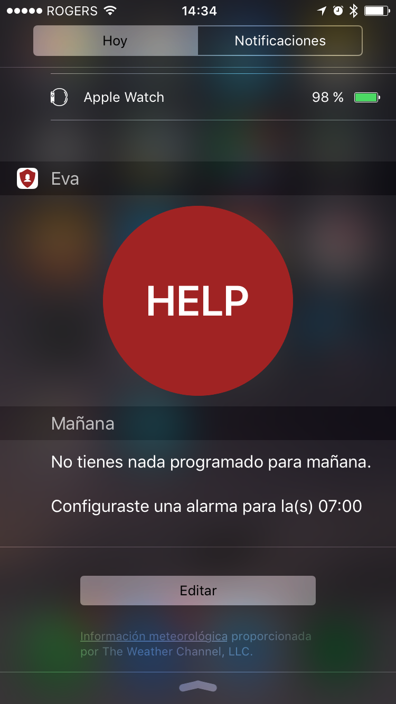
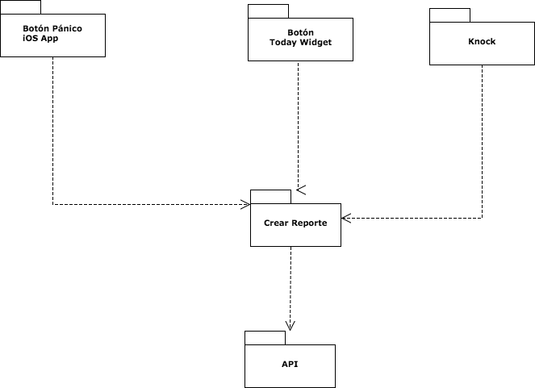
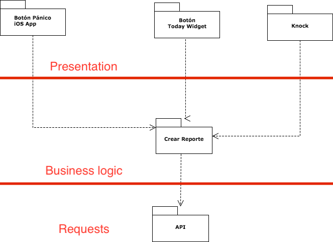
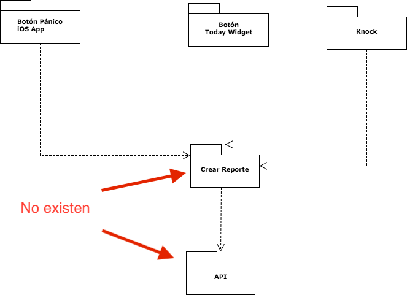
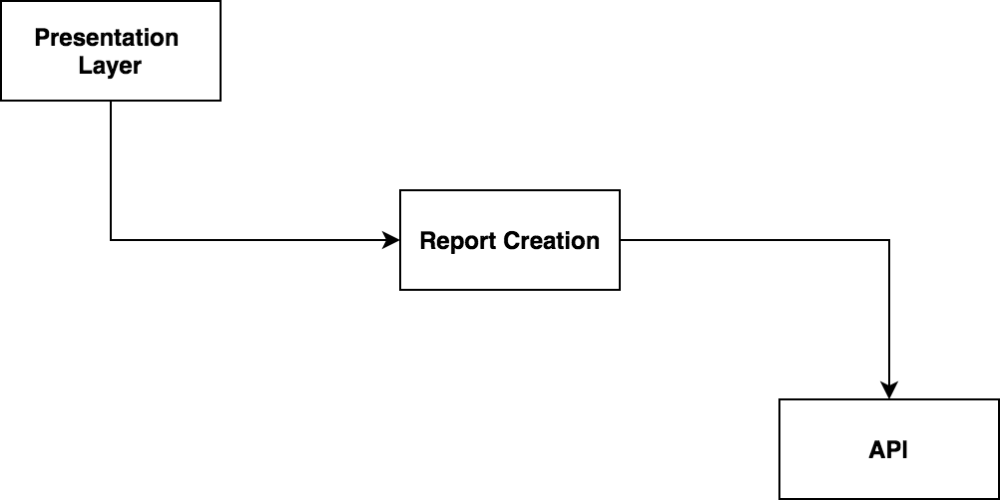
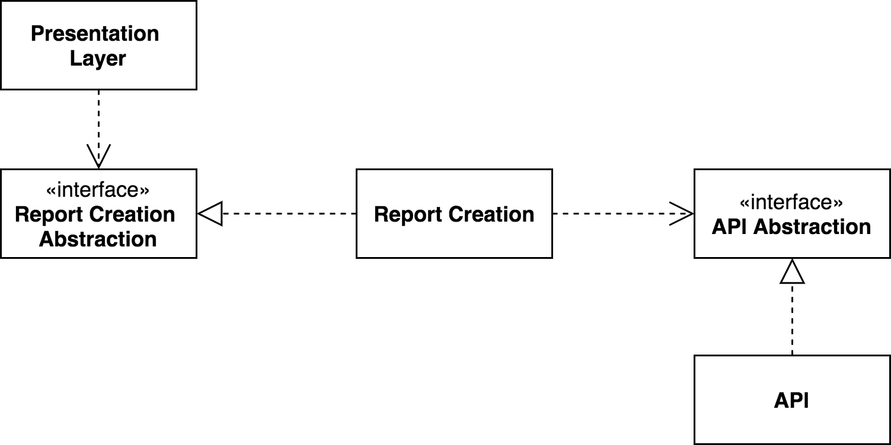
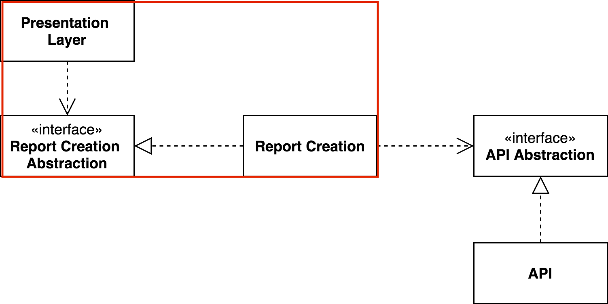
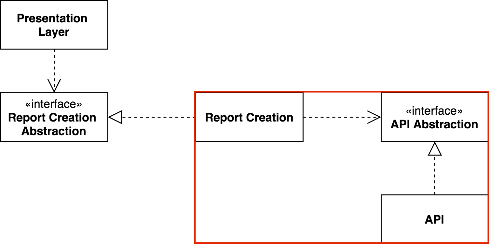
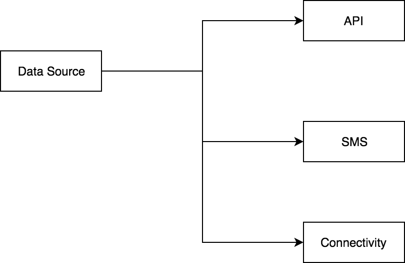
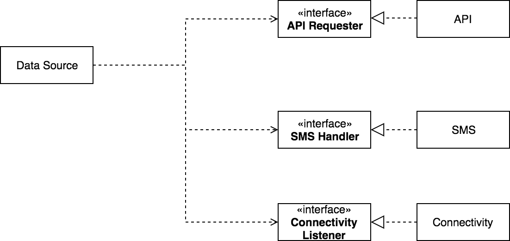

# DEFINIENDO **LIMITES**

---
# [fit] Francisco Díaz


# _**franciscodiaz.cl**_

---


^ El año pasado...
^ Dividimos el trabajo

---

#[fit] **3**
#### desarrolladores iOS 
#[fit] **28** 
#### horas
#[fit] **1**
#### projecto

---

> EVA BC programs provide vital support to anti-violence programs and communities across BC.
-- Ending Violence Association ONG

---


---


# Features:
- Botón de pánico
- Today widget
- Knock

^ A first approach to the app would have been to divide each feature and assign it to one of us.

---

# Botón de pánico:
Al presionar el botón → Reportar


---

# Today widget:
Al presionar el botón → Reportar




---

# Knock

Al golpear el teléfono → Reportar

---

# División de trabajo

---

# Por feature

- **1 Dev**: Pantalla con botón en iOS app
- **1 Dev**: Today widget
- **1 Dev**: Knock

---



---


^ Estas dos capas son reutilizadas
^ Como estas dos capas no existen, solo sabremos que hemos cometido un error al finalizar la integración.

---



^ En vez de dividir por feature, podemos dividir por concerns

---

❌ Una persona por "feature"
✅ Una persona por "capa"

---



^ No sabremos que algo falló hasta que la integración esté completa

---

# Dependencias



---

# Dependency inversion



^ We can fix this by using the dependency inversion principle.
^ We add a boundary in the middle.

---



---

```swift
protocol ReportCreator {
  func createReport() throws -> Report
}
```

---

```swift
class SuccessReportCreator: ReportCreator {
  func createReport() throws -> Report {
    return Report(id: "1", date: Date())
  }
}

class ErrorReportCreator: ReportCreator {
  func createReport() throws -> Report {
    throw ReportCreationError.fakeError
  }
}
```

---

```swift
class BigPanicButtonViewController: UIViewController {
  private let reportCreator: ReportCreator

  init(reportCreator: ReportCreator) {
    self.reportCreator = reportCreator
  }

  func didTapBigPanicButton() {
    do {
      // Handle Report
      let report = try reportCreator.createReport()
    } catch {
      // Handle error
    }
  }
}
```

---

```swift
class BigPanicButtonViewController: UIViewController {
  init(reportCreator: ReportCreator = SuccessReport()) {
    ...
  }
}
```

^ Y asi podemos ver si la integración está correcta, aún cuando no tengamos una forma de crear un reporte "real"

---



^ Ahora, como implementamos lo mismo en la capa de Business Logic?

---

# ¿Si el usuario **no tiene** internet?

---


---



---



---

```swift
protocol APIRequester {
  func createReport() throws -> JSON
}

protocol SMSHandler {
  func sendSMS() throws -> SMS
}

protocol ConnectivityListener {
  var isConnected: Bool { get }
}
```

---

## Nada existe aún,
## **pero podemos probar si funciona**

---

# Recap
- Movernos independientemente
- Reducir conflictos
- No hay necesidad de esperar por integración

---

# [fit] ¿Preguntas?
